# Design Document: Fresh Project Structure

## Overview

This design describes the restructuring of the generatelofi application from a monolithic ~800+ line `page.tsx` into a clean, modular architecture with proper separation of concerns. The restructuring preserves all existing functionality while introducing clear boundaries between UI components, business logic (hooks), data types, service abstractions, and utility functions.

The approach follows a "lift and shift" strategy: extract existing code into well-defined modules without rewriting logic, ensuring functional equivalence throughout the migration.

## Architecture

```mermaid
graph TD
    subgraph "src/app"
        Page["page.tsx (composition layer)"]
        API["api/ (unchanged)"]
    end

    subgraph "src/hooks"
        useGeneration["useGeneration"]
        useAudioPlayer["useAudioPlayer"]
        useAudioVisualizer["useAudioVisualizer"]
        useTrackHistory["useTrackHistory"]
        useCredits["useCredits"]
        usePromptExpand["usePromptExpand"]
    end

    subgraph "src/components"
        subgraph "generation"
            GenerationForm["GenerationForm"]
            GenerationProgress["GenerationProgress"]
            FeaturedPrompts["FeaturedPrompts"]
        end
        subgraph "player"
            AudioPlayer["AudioPlayer"]
            AudioVisualizer["AudioVisualizer"]
            TrackSelector["TrackSelector"]
        end
        subgraph "history"
            TrackHistory["TrackHistory"]
        end
        subgraph "common"
            CreditsDisplay["CreditsDisplay"]
            ErrorBanner["ErrorBanner"]
            ShimmerCard["ShimmerCard"]
            ApiKeyInput["ApiKeyInput"]
        end
    end

    subgraph "src/services"
        generationService["generationService"]
        creditsService["creditsService"]
        statusService["statusService"]
    end

    subgraph "src/types"
        Types["index.ts (barrel)"]
    end

    subgraph "src/lib"
        config["config.ts"]
        constants["constants.ts"]
        trackUtils["trackUtils.ts"]
        formatters["formatters.ts"]
    end

    Page --> useGeneration
    Page --> useAudioPlayer
    Page --> useAudioVisualizer
    Page --> useTrackHistory
    Page --> useCredits
    Page --> usePromptExpand

    Page --> GenerationForm
    Page --> GenerationProgress
    Page --> FeaturedPrompts
    Page --> AudioPlayer
    Page --> AudioVisualizer
    Page --> TrackSelector
    Page --> TrackHistory
    Page --> CreditsDisplay
    Page --> ErrorBanner
    Page --> ShimmerCard
    Page --> ApiKeyInput

    useGeneration --> generationService
    useGeneration --> statusService
    useCredits --> creditsService

    generationService --> API
    creditsService --> API
    statusService --> API
```



### Data Flow

1. **Page** composes hooks and passes their state/actions to components as props
2. **Hooks** encapsulate all stateful logic, side effects, and resource management
3. **Services** abstract HTTP communication with the internal Next.js API routes
4. **Components** are pure rendering units that accept props and emit callbacks
5. **Types** provide shared contracts across all layers
6. **Lib** provides pure utility functions and configuration constants

## Components and Interfaces

### Page Component (`src/app/page.tsx`)

The page becomes a thin composition layer (~60-80 lines):

```typescript
'use client';

import { GenerationForm, GenerationProgress, FeaturedPrompts } from '@/components/generation';
import { AudioPlayer, AudioVisualizer, TrackSelector } from '@/components/player';
import { TrackHistory } from '@/components/history';
import { CreditsDisplay, ErrorBanner, ShimmerCard } from '@/components/common';
import ApiKeyInput from '@/components/ApiKeyInput';
import { useGeneration } from '@/hooks/useGeneration';
import { useAudioPlayer } from '@/hooks/useAudioPlayer';
import { useAudioVisualizer } from '@/hooks/useAudioVisualizer';
import { useTrackHistory } from '@/hooks/useTrackHistory';
import { useCredits } from '@/hooks/useCredits';
import { usePromptExpand } from '@/hooks/usePromptExpand';

export default function Home() {
  // All state delegated to hooks
  const generation = useGeneration();
  const player = useAudioPlayer(generation.audioUrl);
  const visualizer = useAudioVisualizer(player.analyserNode, player.isPlaying);
  const history = useTrackHistory();
  const credits = useCredits(generation.userApiKey);
  const promptExpand = usePromptExpand();

  // At most 1-2 UI-only state variables (e.g., showHistory toggle)
  // Compose components with hook state/actions as props
}
```

### Generation Components (`src/components/generation/`)

**GenerationForm** — Prompt input, style selector, duration picker, instrumental toggle, output count:

```typescript
interface GenerationFormProps {
  prompt: string;
  musicStyle: string;
  makeInstrumental: boolean;
  numOutputs: number;
  outputLength: string;
  isWorking: boolean;
  hasInteracted: boolean;
  onPromptChange: (value: string) => void;
  onMusicStyleChange: (value: string) => void;
  onInstrumentalToggle: () => void;
  onNumOutputsChange: (value: number) => void;
  onOutputLengthChange: (value: string) => void;
  onSubmit: () => void;
  onSmartExpand: () => void;
  onCopyPrompt: () => void;
  onKeyDown: (e: React.KeyboardEvent<HTMLTextAreaElement>) => void;
  textareaRef: React.RefObject<HTMLTextAreaElement | null>;
}
```

**GenerationProgress** — Progress bar, status messages, cancel button:

```typescript
interface GenerationProgressProps {
  progress: number;
  processingMessage: string;
  eta: number | null;
  pollAttempts: number;
  onCancel: () => void;
}
```

**FeaturedPrompts** — Grid of preset prompt buttons:

```typescript
interface FeaturedPromptsProps {
  prompts: readonly FeaturedPrompt[];
  isWorking: boolean;
  onSelect: (prompt: FeaturedPrompt) => void;
}
```

### Player Components (`src/components/player/`)

**AudioPlayer** — Play/pause, progress bar, volume, loop toggle:

```typescript
interface AudioPlayerProps {
  audioUrl: string;
  isPlaying: boolean;
  isLooping: boolean;
  currentTime: number;
  trackDuration: number;
  volume: number;
  shouldRefreshAudioKey: boolean;
  onTogglePlayPause: () => void;
  onToggleLoop: () => void;
  onSeek: (time: number) => void;
  onVolumeChange: (volume: number) => void;
  onTimeUpdate: (time: number) => void;
  onLoadedMetadata: (duration: number) => void;
  onEnded: () => void;
  onError: () => void;
  audioRef: React.RefObject<HTMLAudioElement | null>;
}
```

**AudioVisualizer** — Canvas-based frequency visualization:

```typescript
interface AudioVisualizerProps {
  canvasRef: React.RefObject<HTMLCanvasElement | null>;
  isPlaying: boolean;
}
```

**TrackSelector** — Tab-based track version selection:

```typescript
interface TrackSelectorProps {
  tracks: Track[];
  activeTrackIndex: number;
  onSelect: (index: number, track: Track) => void;
}
```

### History Components (`src/components/history/`)

**TrackHistory** — Panel showing recent generations:

```typescript
interface TrackHistoryProps {
  entries: HistoryEntry[];
  onSelect: (entry: HistoryEntry) => void;
}
```

### Common Components (`src/components/common/`)

**CreditsDisplay** — Credits badge with refresh and low-balance warning:

```typescript
interface CreditsDisplayProps {
  credits: number | null;
  creditsLoadFailed: boolean;
  creditsLow: boolean;
  onRefresh: () => void;
}
```

**ErrorBanner** — Dismissible error display with retry:

```typescript
interface ErrorBannerProps {
  error: string | null;
  errorDetails: string | null;
  retryCount: number;
  canRetry: boolean;
  onRetry: () => void;
  onDismiss: () => void;
}
```

**ShimmerCard** — Loading skeleton placeholder:

```typescript
// No props needed - pure presentational
```

### Custom Hooks (`src/hooks/`)

**useGeneration** — Orchestrates the full generation lifecycle:

```typescript
interface UseGenerationReturn {
  // State
  status: GenerationStatus;
  audioUrl: string | null;
  taskId: string | null;
  progress: number;
  processingMessage: string;
  songTitle: string | null;
  eta: number | null;
  tracks: Track[];
  activeTrackIndex: number;
  error: string | null;
  errorDetails: string | null;
  showErrorBanner: boolean;
  retryCount: number;
  isPreview: boolean;
  upgradeAvailable: boolean;
  userApiKey: string | null;
  serverKeyConfigured: boolean | null;
  pollAttempts: number;

  // Actions
  generate: (isRetry?: boolean) => Promise<void>;
  cancel: () => void;
  reset: () => void;
  selectTrack: (index: number, track: Track) => void;
  setUserApiKey: (key: string | null) => void;
  dismissError: () => void;
  setUpgradeAvailable: (value: boolean) => void;
  setOutputLength: (value: string) => void;
}
```

**useAudioPlayer** — Manages Web Audio API and playback:

```typescript
interface UseAudioPlayerReturn {
  // State
  isPlaying: boolean;
  isLooping: boolean;
  currentTime: number;
  trackDuration: number;
  volume: number;
  shouldRefreshAudioKey: boolean;
  analyserNode: AnalyserNode | null;

  // Actions
  togglePlayPause: () => void;
  toggleLoop: () => void;
  seek: (time: number) => void;
  setVolume: (volume: number) => void;
  setCurrentTime: (time: number) => void;
  setTrackDuration: (duration: number) => void;
  onEnded: () => void;
  onError: () => void;

  // Refs
  audioRef: React.RefObject<HTMLAudioElement | null>;
}
```

**useAudioVisualizer** — Canvas animation loop for frequency data:

```typescript
interface UseAudioVisualizerReturn {
  canvasRef: React.RefObject<HTMLCanvasElement | null>;
}
```

**useTrackHistory** — localStorage-backed history with max 5 entries:

```typescript
interface UseTrackHistoryReturn {
  // State
  history: HistoryEntry[];
  showHistory: boolean;

  // Actions
  saveToHistory: (entry: HistoryEntry) => void;
  selectFromHistory: (entry: HistoryEntry) => HistoryEntry;
  toggleHistory: () => void;
}
```

**useCredits** — Fetches and monitors credit balance:

```typescript
interface UseCreditsReturn {
  // State
  credits: number | null;
  creditsLoadFailed: boolean;
  creditsLow: boolean;

  // Actions
  refreshCredits: () => void;
}
```

**usePromptExpand** — Smart expand with keyword templates and generic expansion:

```typescript
interface UsePromptExpandReturn {
  // Actions
  smartExpand: (prompt: string) => string | null;
  canExpand: (prompt: string) => boolean;
}
```

### Services (`src/services/`)

**generationService** — Wraps `/api/generate` POST:

```typescript
interface GenerationRequest {
  prompt: string;
  musicStyle?: string;
  makeInstrumental?: boolean;
  numOutputs?: number;
  outputLength?: string;
  userApiKey?: string;
}

interface GenerationResponse {
  taskId: string;
  conversionId1: string | null;
  conversionId2: string | null;
  eta: number | null;
  creditEstimate: number | null;
}

export async function startGeneration(params: GenerationRequest): Promise<GenerationResponse>;
```

**creditsService** — Wraps `/api/credits` GET:

```typescript
interface CreditsResponse {
  credits: number | null;
  error?: string;
}

export async function fetchCredits(apiKey?: string): Promise<CreditsResponse>;
```

**statusService** — Wraps `/api/status/stream/[taskId]` SSE:

```typescript
interface StatusEvent {
  status: 'processing' | 'completed' | 'failed';
  progress: number;
  message?: string;
  audioUrl?: string;
  title?: string;
  tracks?: Track[];
  error?: string;
}

export function connectStatusStream(
  taskId: string,
  apiKey: string | undefined,
  onEvent: (event: StatusEvent) => void,
  onError: (error: Error) => void
): { close: () => void };
```

## Data Models

### Core Types (`src/types/index.ts`)

```typescript
// Track version identifiers
export type TrackVersion = 'v1' | 'v2';

// Generation lifecycle states
export type GenerationStatus = 'idle' | 'generating' | 'polling' | 'completed' | 'error';

// Audio track data
export interface Track {
  url: string | null;
  wavUrl: string | null;
  title: string | null;
  duration: number | null;
  version?: TrackVersion;
}

// History entry for localStorage persistence
export interface HistoryEntry {
  id: string;
  taskId: string;
  prompt: string;
  musicStyle?: string;
  makeInstrumental?: boolean;
  title: string | null;
  tracks: Track[];
  createdAt: number;
}

// API request/response types
export interface GenerationRequest {
  prompt: string;
  music_style?: string;
  make_instrumental?: boolean;
  num_outputs?: string;
  output_length?: string;
  userApiKey?: string;
}

export interface GenerationApiResponse {
  taskId: string;
  conversionId1: string | null;
  conversionId2: string | null;
  eta: number | null;
  creditEstimate: number | null;
}

export interface CreditsApiResponse {
  credits: number | null;
  error?: string;
  planId?: string | null;
  totalChargedThisMonth?: number;
  expiresAt?: string | null;
}

export interface StatusEventData {
  status: 'processing' | 'completed' | 'failed';
  progress: number;
  message?: string;
  audioUrl?: string;
  title?: string;
  tracks?: Track[];
  error?: string;
}

// Service error type
export interface ServiceError {
  message: string;
  status: number;
  details?: unknown;
}

// Featured prompt from constants
export interface FeaturedPrompt {
  label: string;
  prompt: string;
  style: string;
}
```

### Target Folder Structure

```
src/
├── app/
│   ├── api/                          # Unchanged
│   │   ├── credits/route.ts
│   │   ├── generate/route.ts
│   │   ├── status/
│   │   │   ├── stream/[taskId]/route.ts
│   │   │   └── [taskId]/route.ts
│   │   └── utils/apiKeyManager.ts
│   ├── page.tsx                      # Thin composition layer (<100 lines)
│   ├── layout.tsx
│   ├── globals.css
│   └── favicon.ico
├── components/
│   ├── generation/
│   │   ├── GenerationForm.tsx
│   │   ├── GenerationProgress.tsx
│   │   ├── FeaturedPrompts.tsx
│   │   └── index.ts
│   ├── player/
│   │   ├── AudioPlayer.tsx
│   │   ├── AudioVisualizer.tsx
│   │   ├── TrackSelector.tsx
│   │   └── index.ts
│   ├── history/
│   │   ├── TrackHistory.tsx
│   │   └── index.ts
│   ├── common/
│   │   ├── CreditsDisplay.tsx
│   │   ├── ErrorBanner.tsx
│   │   ├── ShimmerCard.tsx
│   │   └── index.ts
│   ├── ApiKeyInput.tsx               # Existing, moved to common/ or kept at root
│   ├── ErrorBoundary.tsx             # Existing
│   └── index.ts
├── hooks/
│   ├── useGeneration.ts
│   ├── useAudioPlayer.ts
│   ├── useAudioVisualizer.ts
│   ├── useTrackHistory.ts
│   ├── useCredits.ts
│   ├── usePromptExpand.ts
│   └── index.ts
├── services/
│   ├── generationService.ts
│   ├── creditsService.ts
│   ├── statusService.ts
│   └── index.ts
├── types/
│   ├── index.ts                      # Barrel re-exporting all types
│   ├── track.ts
│   ├── generation.ts
│   ├── api.ts
│   └── history.ts
└── lib/
    ├── config.ts                     # Unchanged
    ├── constants.ts                  # Unchanged
    ├── trackUtils.ts                 # Unchanged
    └── formatters.ts                 # New: formatDuration, estimateCost
```

## Correctness Properties

*A property is a characteristic or behavior that should hold true across all valid executions of a system — essentially, a formal statement about what the system should do. Properties serve as the bridge between human-readable specifications and machine-verifiable correctness guarantees.*

### Property 1: Component file size limit

*For any* file in `src/components/`, the line count of that file SHALL be less than or equal to 150 lines.

**Validates: Requirements 1.2**

### Property 2: No circular import dependencies

*For any* component file in `src/components/`, following its transitive import chain within the components directory SHALL never lead back to the originating file.

**Validates: Requirements 1.12**

### Property 3: History length invariant

*For any* sequence of `saveToHistory` calls with arbitrary HistoryEntry objects, the resulting history array length SHALL never exceed `MAX_HISTORY_ENTRIES` (5).

**Validates: Requirements 2.5**

### Property 4: Smart expand keyword matching

*For any* prompt string that contains a keyword from `PROMPT_TEMPLATES` and has fewer than 8 words, calling `smartExpand` SHALL return the corresponding template string. *For any* prompt of 2 to 5 words that does not match any keyword, calling `smartExpand` SHALL return the generic expansion template with the original prompt embedded.

**Validates: Requirements 2.7**

### Property 5: Hook files contain no JSX

*For any* file in `src/hooks/`, the file content SHALL contain zero JSX elements (no `<` followed by a component name or HTML tag in a return statement context).

**Validates: Requirements 2.9**

### Property 6: Type import consistency

*For any* type that is exported from `src/types/index.ts`, no other file in the project SHALL define that same type locally, and all imports of that type SHALL reference `@/types` or `@/types/index`.

**Validates: Requirements 3.6, 3.8, 3.9**

### Property 7: Service error propagation

*For any* network error (connection refused, DNS failure, timeout) encountered by a service function, the function SHALL throw a `ServiceError` with status 503. *For any* non-success HTTP response (status >= 400) from the upstream API, the service function SHALL throw a `ServiceError` preserving the upstream status code.

**Validates: Requirements 4.5, 4.6**

### Property 8: Service authorization header

*For any* non-empty string passed as the `apiKey` parameter to a service function, the outgoing HTTP request SHALL include an `Authorization` header with value `Bearer {apiKey}`.

**Validates: Requirements 4.7**

### Property 9: Import path convention

*For any* import statement in files under `src/`, if the import crosses directory boundaries (e.g., a component importing from hooks), it SHALL use a `@/` path alias and SHALL NOT use relative paths that traverse above the importing file's parent directory.

**Validates: Requirements 5.6**

### Property 10: HistoryEntry serialization round-trip

*For any* valid `HistoryEntry` object, serializing it with `JSON.stringify` and then deserializing with `JSON.parse` SHALL produce an object with identical field values (preserving the localStorage data format contract).

**Validates: Requirements 8.3**

### Property 11: Page component state delegation

*For any* version of `page.tsx` after restructuring, the file SHALL contain at most 2 `useState` declarations (for UI-only local state such as panel visibility toggles).

**Validates: Requirements 6.2**

## Error Handling

### Service Layer Errors

All service functions throw typed `ServiceError` objects rather than raw exceptions:

| Error Condition | Status Code | Behavior |
|---|---|---|
| Network failure (DNS, timeout, connection refused) | 503 | Throw `ServiceError` with descriptive message |
| Upstream 401 (invalid API key) | 401 | Throw `ServiceError`, hook surfaces to UI |
| Upstream 402 (insufficient credits) | 402 | Throw `ServiceError`, hook surfaces to UI |
| Upstream 429 (rate limited) | 429 | Throw `ServiceError` with retry timing |
| Upstream 5xx (server error) | 500/502/503 | Throw `ServiceError` with upstream message |

### Hook Error Handling

Each hook exposes an `error` property in its return interface:

- `useGeneration.error` — Generation failures, SSE errors, timeout
- `useCredits.creditsLoadFailed` — Credits fetch failure flag
- `useAudioPlayer` — Audio load/playback errors surfaced via callback

### Component Error Display

- **ErrorBanner** — Displays `errorDetails` with auto-dismiss after `ERROR_DISMISS_DELAY_MS` (8000ms)
- **Inline error** — Simple red box for non-banner errors (e.g., cancelled state)
- **Error clear on cancel** — Errors clear after `ERROR_CLEAR_DELAY_MS` (3000ms) when user cancels

### Resource Cleanup

All hooks with resources implement cleanup:
- `useGeneration` — Closes EventSource, clears intervals/timeouts on unmount
- `useAudioPlayer` — Closes AudioContext, disconnects nodes on unmount
- `useAudioVisualizer` — Cancels animation frame on unmount or when playback stops

## Testing Strategy

### Unit Tests (Example-Based)

- **Components**: Render each component with representative props, verify correct DOM output
- **Hooks**: Use `renderHook` from React Testing Library to test hook state transitions
- **Services**: Mock `fetch` and verify request construction and response parsing
- **Utilities**: Test `formatDuration` and `estimateCost` with specific input/output pairs
- **Edge cases**: Empty prompts, null audio URLs, zero credits, max history overflow

### Property-Based Tests

**Library**: [fast-check](https://github.com/dubzzz/fast-check) (TypeScript-native PBT library)

**Configuration**: Minimum 100 iterations per property test.

Each property test references its design document property with a tag comment:

```typescript
// Feature: fresh-project-structure, Property 3: History length invariant
```

Properties to implement:
1. **History length invariant** — Generate random sequences of HistoryEntry additions, verify length <= 5
2. **Smart expand keyword matching** — Generate random prompts with/without keywords, verify correct expansion
3. **Service error propagation** — Generate random HTTP status codes and network errors, verify correct ServiceError
4. **Service auth header** — Generate random API key strings, verify Bearer token in request
5. **HistoryEntry serialization round-trip** — Generate random HistoryEntry objects, verify JSON round-trip

### Integration Tests

- **Build verification**: `next build` succeeds without errors
- **Visual regression**: Compare rendered output at 1280x720 and 375x667 viewports
- **API route preservation**: Verify unchanged request/response contracts
- **localStorage compatibility**: Load pre-existing history data after restructure

### Migration Verification Checklist

1. `npm run build` passes with zero errors
2. `npm run lint` passes
3. All existing keyboard shortcuts work (Enter to generate, Space to play, Escape to cancel)
4. localStorage keys `musicgpt_api_key` and `ghostname_history` remain compatible
5. All ARIA attributes preserved on interactive elements
6. `beforeunload` warning fires during generation
7. Error auto-dismiss timing unchanged (8000ms)
